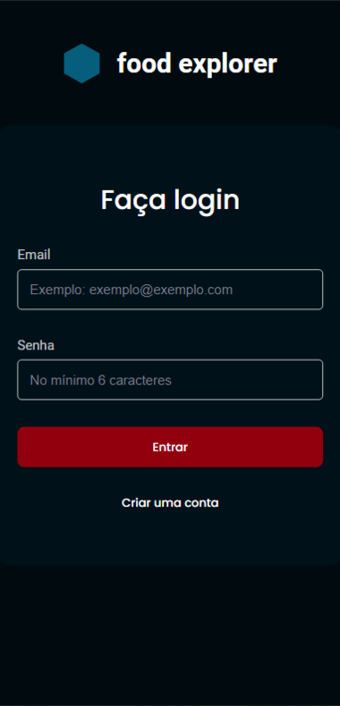
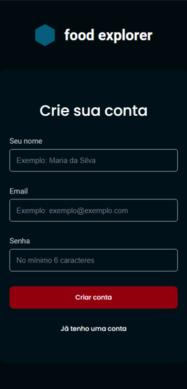
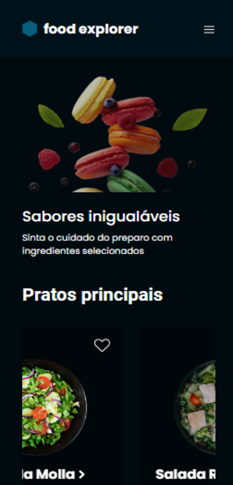
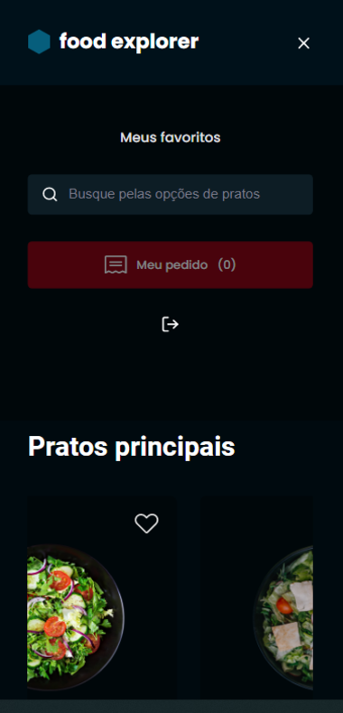
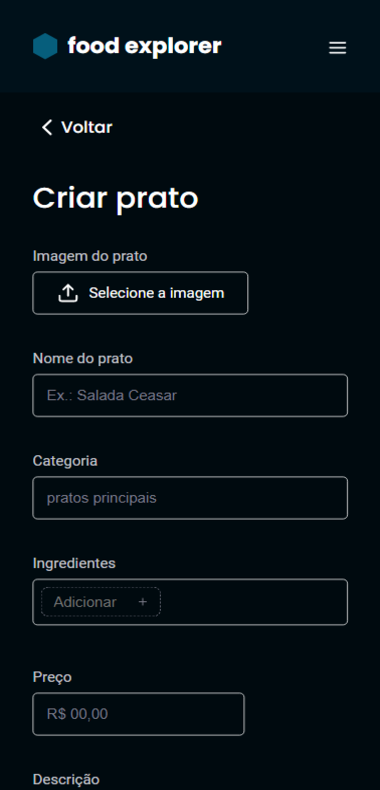
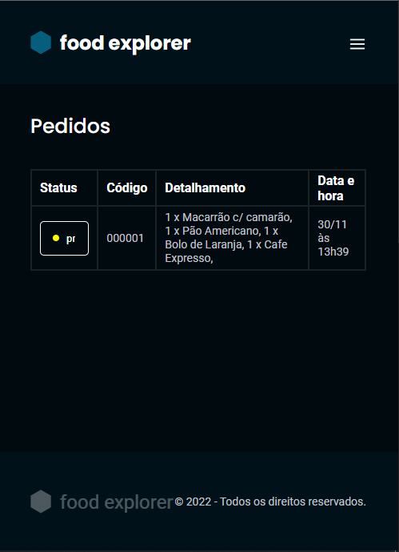

# Food Explorer

<h1 align="center">
    
</h1>

<p align="center">
	
  
	
  
	
  


</p>

<br>

### 💻 Food Explorer

Building a application that we will develop a digital menu for a restaurant, known as Food Explorer. In this challenge, the following topics were addressed:

- React;
- Routes;
- components;
- Props;
- hooks;
- context;

Watch it in action Deploy: [Click Here](https://food-explorer-rest.netlify.app/)

Login User: cliente@email.com  
Password: 123456

What was developed:

- [x] Logic and Algorithms with Javascript;
- [x] Use the Vite;
- [x] Deploy Front end Netlify, deploy back end Render;
- [x] Style and format application with Styled Components;
- [x] Hooks User authentication;
- [x] Building the application in blocks with components with the ReactJS tool;
- [x] Navigation with React Router Dom;
- [x] A structured project, with a good organization of folders, division of components in the front-end, etc.
- [x] A README.md file with specifications on how to run the project in a dev environment.
- [x] Users must authenticate themselves to enter the application through the login screen, you can apply what you learned in JWT authentication classes. Authentication must be validated with a password.
- [x] The admin will upload images to register the dishes.
- [x] Finally, deploy your application.
- [x] Give your functions and variables meaningful names: work with Clean Code concepts a bit.
- [x] The admin, restaurant and users data will be stored in a database.
- [x] Possibility to search by dish name, ingredients or favorite dish
- [x] It is essential that your interface consumes its own API.
- [x] Interesting to make the application responsive: use the concept of Mobile First that was learned in class.
- [x] It's up to you where to apply animations, transitions, and transformations.
- [x] It meets the model proposed in Figma and contains elements indicative of action and state.
opcionais
- [x] The user can add items to the cart by clicking the add button. The amount is controlled by the “-” and “+” buttons;
- [x] By clicking on the my order button, the user will be redirected to a screen where he will see his order, the sum and the payment methods;
- [x] The user will be able to delete a dish from the cart and the total amount of the order should be updated automatically;
- [x] The user can mark a dish as a favorite, just click on the heart that appears next to each one;
- [x] The admin will view and control the status of each order, through a select field. Orders will appear in a table when you click Orders;
<br />

<p>Web Food Explorer CLient</p>


<br />
<br />
<p>Web Food Explorer Admin</p>


<br />
<br />
<p>Mobile Food Explorer </p>







<br />
## 🧪 Tools

Application developed using the following tools:

- [React](https://reactjs.org)
- [Rocket Movies Api](https://github.com/felipe-gomes-vicente/rocket-movies-api)
- [Javascript](https://developer.mozilla.org/pt-BR/docs/Web/JavaScript)
- [React-router-dom](https://reactrouter.com/web/guides/quick-start)
- [Styled Components](https://styled-components.com/)
- [Vite](https://vitejs.dev/)


## 🚀 Getting started

Clone Project and access folder and start the server it is necessary to have NodeJs, Git
installed and Visual Studio Code.

### Programs needed to Getting started

- [NodeJS](https://nodejs.org/en/)
- [Visual Studio Code - Vscode](https://code.visualstudio.com/)
- [Git](https://git-scm.com/)

This project is divided into two parts:
1. Backend (food-explorer-api folder) 
2. Frontend (food-explorer folder)

💡 The Frontend needs the Backend to be running to work.

<br />

### Install server and start up

```bash
# Clone this repository
$ git clone https://github.com/felipe-gomes-vicente/food-explorer-api.git

# Access the project folder in your terminal
$ cd food-explorer-api

# Install the dependencies
$ npm install

# run the migration and seed
$ npm migrate
$ npm seed

# Run the application in development mode
$ npm run dev

# Admin login
$ email: admin@email.com
$ password: 0908

# Client login
$ email: cliente@email.com
$ password: 123456

# The Server will start at port: 3333 - go to http://localhost:3333
```

<br />

Clone the project and access the folder

```bash
# Clone this repository
$ git clone https://github.com/felipe-gomes-vicente/food-explorer.git

# Access the project folder in your terminal
$ cd food-explorer

# Install the dependencies
$ npm install

# Run the application in development mode
$ npm run dev

# The application will open on the port: 3000 - go to http://localhost:5173/ or http://127.0.0.1:5173/ 
```

<br />

## 📝 License

This project is under the MIT license. See the file [LICENSE](LICENSE) for more details.

---

&nbsp;

<p align="center">Done with 💜 by Felipe Vicente👋</p>

- ## My LinkedIn - [](https://www.linkedin.com/in/felipe-gomes-vicente/)
